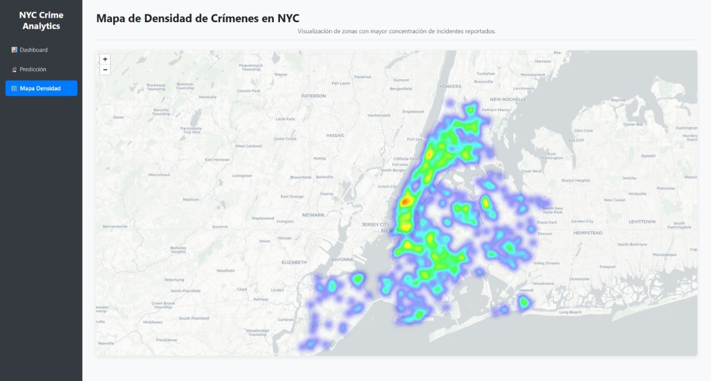
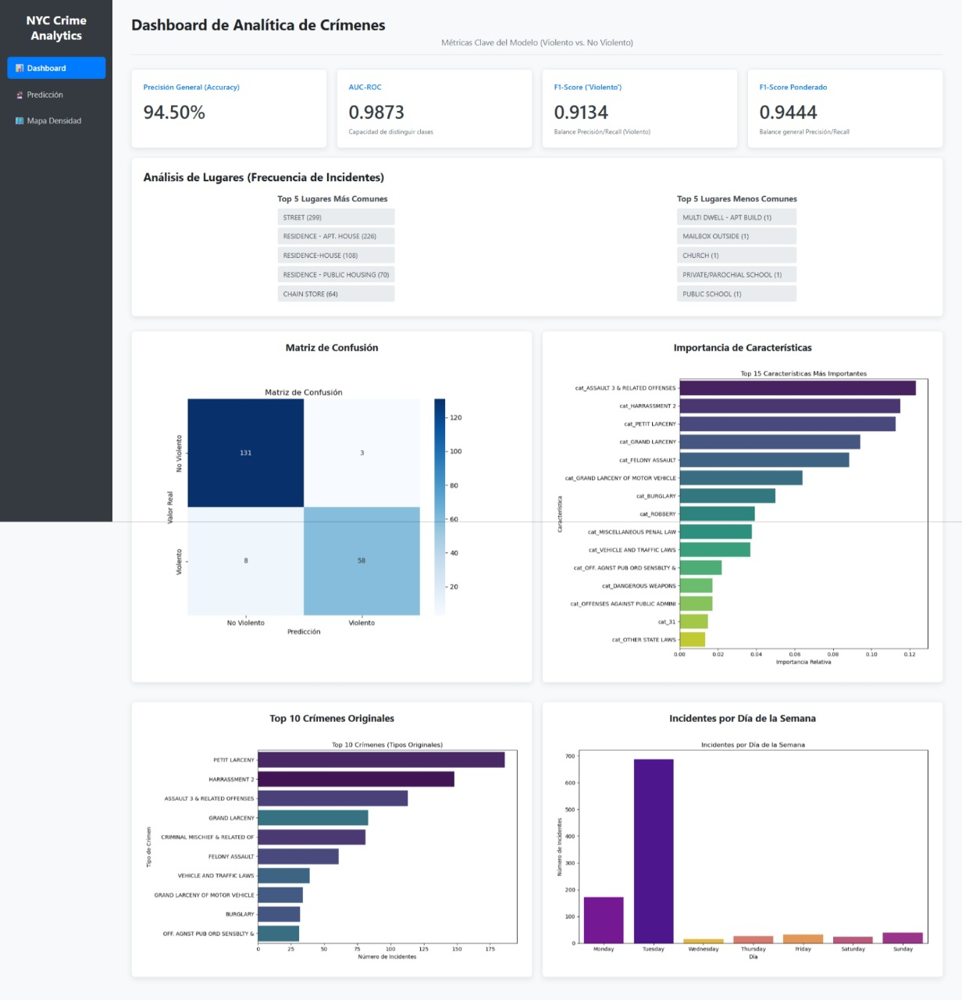
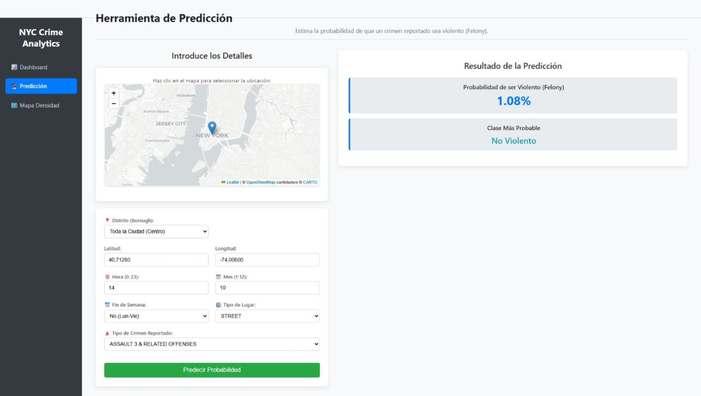
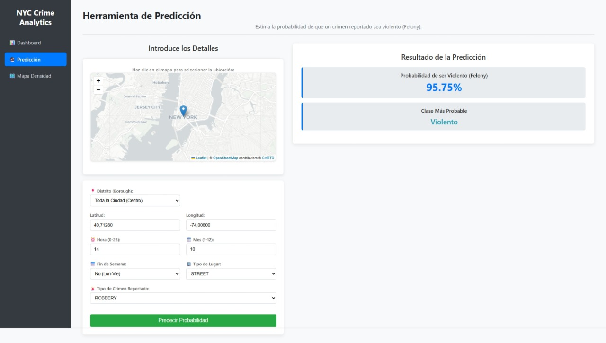

# Reporte: Predicción de Crímenes Violentos en NYC usando Machine Learning

*Estudiantes*
* Diego Suárez (0000277124) - Ingeniería Informática
* John Jairo Rojas (0000282452) - Ingeniería Informática
* Giovanni Moreno (0000247483) - Ingeniería Informática

*Universidad de la Sabana*
*Machine Learning*

*Profesor:* Hugo Franco, Ph.D.
*Fecha:* 20 de octubre de 2025

---

## 1. Introducción

### 1.1 Contexto y Relevancia

El análisis y la predicción de patrones criminales se han convertido en herramientas indispensables para la gestión de la seguridad pública en metrópolis globales como la ciudad de Nueva York (NYC). La capacidad de anticipar y comprender la dinámica del crimen permite una asignación más eficiente de recursos policiales, el diseño de estrategias de prevención focalizadas y, en última instancia, contribuye a la creación de entornos urbanos más seguros. Dentro de este amplio espectro, la clasificación de la gravedad de los incidentes reportados adquiere una relevancia particular. Distinguir entre crímenes violentos, típicamente asociados a delitos graves ('Felonies'), y aquellos considerados no violentos ('Misdemeanors' o 'Violations'), ofrece información valiosa para evaluar el riesgo inherente a diferentes situaciones y contextos, informando así la priorización de respuestas y la planificación a largo plazo.

### 1.2 Definición del Problema y Objetivos

Este proyecto se centra en el desarrollo y la evaluación rigurosa de un modelo de Machine Learning diseñado para la clasificación automática de denuncias criminales en NYC. Específicamente, el modelo busca determinar si un incidente reportado es violento (`is_violent = 1`, correspondiente a 'Felony') o no violento (`is_violent = 0`, correspondiente a 'Misdemeanor' o 'Violation'). El objetivo central es abordar la pregunta de investigación: *"Dadas las características espaciales, temporales y contextuales de un incidente reportado en NYC (incluyendo ubicación geográfica precisa, momento del día y del año, tipo de lugar donde ocurre y la descripción específica de la ofensa), ¿es posible construir un modelo predictivo que clasifique con alta precisión si dicho incidente corresponde a un crimen violento (Felony)?"*.

La hipótesis fundamental que guía este trabajo es que una combinación sinérgica de estas diversas características, procesadas mediante técnicas avanzadas de ingeniería de características como el clustering geoespacial (K-Means) y la codificación cíclica de variables temporales, contiene la información necesaria para permitir una predicción eficaz y precisa de la naturaleza violenta de un incidente.

### 1.3 Justificación Metodológica a partir del EDA

Los hallazgos derivados de un Análisis Exploratorio de Datos (EDA) preliminar fueron cruciales para refinar el enfoque del problema y justificar las decisiones metodológicas subsecuentes:
* **Selección de la Variable Objetivo:** El EDA reveló que intentar una clasificación multiclase directamente sobre los aproximadamente 180 tipos distintos de descripciones de ofensa (`ofns_desc`) presentaba desafíos significativos debido al severo desbalance entre categorías y la alta granularidad. En cambio, la binarización basada en la categoría legal (`law_cat_cd`), agrupando 'Misdemeanor' y 'Violation' como 'No Felony', resultó en una proporción de clases más equilibrada (aproximadamente 33% 'Felony' vs. 67% 'No Felony'), definiendo `is_violent` como una variable objetivo más tratable y pragmática.
* **Relevancia de las Características:** El EDA confirmó la existencia de patrones discernibles en los datos. Se observaron variaciones significativas en la ocurrencia de crímenes según la hora del día y si era fin de semana. Los análisis geoespaciales, incluyendo mapas de calor, evidenciaron concentraciones espaciales ("zonas calientes"), sugiriendo la utilidad de características basadas en la ubicación. Asimismo, se constató que la tasa de violencia variaba considerablemente según el tipo de lugar (`prem_typ_desc`) y, notablemente, según la descripción específica de la ofensa (`ofns_desc`). Estos hallazgos validaron la inclusión de características temporales, geoespaciales y contextuales en el modelo predictivo.

### 1.4 Contribución Esperada

La implementación exitosa de este modelo, junto con su despliegue en una herramienta interactiva, no solo busca alcanzar una alta precisión predictiva, sino también ofrecer una herramienta analítica valiosa. Dicha herramienta podría facilitar una comprensión más profunda de los factores correlacionados con la violencia criminal en NYC y potencialmente servir de apoyo en la toma de decisiones estratégicas y operativas relacionadas con la seguridad pública.

---

## 2. Métodos

### 2.1 Fuente y Preparación de Datos

La base de este estudio es el conjunto de datos "NYPD Complaint Data Historic", obtenido del portal NYC OpenData, una fuente rica en detalles sobre incidentes reportados. La fase de ingesta (`data_ingestion.py`) automatizó la descarga de estos datos, aplicando un filtro temporal para retener únicamente los registros a partir del 1 de enero de 2020. Esta decisión buscó enfocar el análisis en patrones contemporáneos y manejar eficientemente el volumen de datos (limitado a 50,000 registros en la URL para agilizar el proceso).

Un paso crítico de preprocesamiento (`preprocessing.py`) incluyó la estandarización de nombres de columnas a minúsculas y la eliminación rigurosa de filas que presentaran valores nulos en columnas consideradas indispensables: `cmplnt_fr_dt` (fecha/hora), `latitude`, `longitude`, `prem_typ_desc` (tipo de lugar), `ofns_desc` (descripción), `law_cat_cd` (categoría legal), y `boro_nm` (distrito). La columna `cmplnt_fr_dt` fue parseada a formato datetime de Pandas para habilitar la extracción de componentes temporales. Aunque se exploró la incorporación de datos adicionales sobre arrestos y paradas de vehículos, estos fueron excluidos del modelado final debido a la indisponibilidad de uno de los datasets (error 404) y la complejidad inherente a la fusión fiable entre datasets dispares.

### 2.2 Variable Objetivo (`is_violent`)

La variable dependiente del modelo, `is_violent`, se construyó como una transformación binaria de la columna `law_cat_cd`. Se asignó `1` a los incidentes clasificados como 'FELONY' (considerados proxy de 'violentos' en este contexto) y `0` a aquellos clasificados como 'MISDEMEANOR' o 'VIOLATION' (agrupados como 'no violentos'). Esta definición operativa, justificada por el EDA, simplifica el problema a una clasificación binaria con un desbalance de clases inicial más manejable (aproximadamente 1/3 vs 2/3).

### 2.3 Ingeniería de Características

El script `preprocessing.py` implementó un conjunto diverso de transformaciones para extraer señales predictivas:

* **Características Temporales:** Para modelar adecuadamente la ciclicidad inherente a los patrones horarios y estacionales, se aplicaron transformaciones trigonométricas (seno y coseno) a la hora del día y al mes del año, generando `hour_sin`, `hour_cos`, `month_sin`, `month_cos`. Estas representaciones continuas evitan saltos artificiales (ej., entre las 23:00 y 00:00). Adicionalmente, se creó la variable binaria `is_weekend` para capturar posibles diferencias en patrones criminales durante los fines de semana.
* **Características Geoespaciales (Clustering K-Means):** Dada la evidencia del EDA sobre la concentración espacial del crimen (Figura 1), se utilizó el algoritmo K-Means (MacQueen, 1967) sobre las coordenadas `latitude` y `longitude` para segmentar el espacio geográfico en $k=50$ clusters distintos. Cada incidente fue asignado a uno de estos clusters, generando la característica categórica `crime_cluster`. Este enfoque busca capturar patrones locales o de vecindario no evidentes solo por las coordenadas. Las coordenadas originales también se incluyeron como características numéricas.

    
    *(Figura 1: Mapa de calor mostrando la concentración geográfica de denuncias en NYC)*

* **Características Categóricas:** Las variables `prem_typ_desc`, `crime_cluster` (generada por K-Means) y `ofns_desc` fueron tratadas como categóricas. Debido a la alta cardinalidad de `ofns_desc`, se aplicó un filtro heurístico, reteniendo solo aquellas categorías que aparecían más de 10 veces en el conjunto de datos filtrado, para controlar la dimensionalidad. Posteriormente, se aplicó codificación One-Hot (`pd.get_dummies`) a estas tres variables, generando un conjunto de características binarias (ej., `cat_STREET`, `cat_crime_cluster_15`, `cat_ROBBERY`). Se utilizó `drop_first=True` durante la codificación para mitigar la multicolinealidad.

### 2.4 Manejo del Desbalance de Clases (SMOTE)

A pesar de la binarización, la clase 'Violento' (`is_violent = 1`) seguía siendo minoritaria (~31-33%). Para asegurar que el modelo no desarrollara un sesgo hacia la predicción de la clase mayoritaria ('No Violento'), se implementó la técnica de sobremuestreo SMOTE (Synthetic Minority Over-sampling Technique) (Chawla et al., 2002) utilizando la librería `imbalanced-learn` (Lemaître et al., 2017). SMOTE genera instancias sintéticas de la clase minoritaria basándose en sus vecinos más cercanos en el espacio de características. Crucialmente, esta técnica se aplicó **exclusivamente al conjunto de entrenamiento** después de la división train-test, preservando la distribución original de clases en el conjunto de prueba para una evaluación imparcial.

### 2.5 División de Datos y Escalado

El dataset, ya enriquecido con las características diseñadas y codificado numéricamente, se dividió en un 80% para entrenamiento y un 20% para prueba (`train_test_split`). Se empleó estratificación (`stratify=y`) para mantener la proporción de la variable `is_violent` en ambas particiones. Las características numéricas (`latitude`, `longitude`, y las transformaciones seno/coseno de hora y mes) fueron escaladas a tener media cero y desviación estándar uno utilizando `StandardScaler` (Pedregosa et al., 2011). El escalador se ajustó (`fit`) únicamente sobre los datos de entrenamiento (ya balanceados por SMOTE) y se utilizó para transformar (`transform`) ambos conjuntos (entrenamiento y prueba). Tanto el `StandardScaler` ajustado como un `LabelEncoder` para mapear 0/1 a 'No Violento'/'Violento' fueron serializados y guardados (`scaler.joblib`, `label_encoder.joblib`).

### 2.6 Modelo de Clasificación (XGBoost) y Optimización

Se seleccionó `XGBClassifier` (Chen & Guestrin, 2016), una implementación eficiente y potente del algoritmo de gradient boosting, como modelo de clasificación principal. Esta elección se basó en su capacidad demostrada para manejar datos tabulares, capturar interacciones complejas y su robustez general.

Para optimizar el rendimiento del modelo, se realizó una búsqueda de hiperparámetros utilizando `RandomizedSearchCV` (Pedregosa et al., 2011). Se definió un espacio de búsqueda para `n_estimators` (número de árboles), `learning_rate` (tasa de aprendizaje), `max_depth` (profundidad máxima del árbol), `subsample` (fracción de muestras por árbol) y `colsample_bytree` (fracción de características por árbol). Se ejecutaron 20 combinaciones aleatorias (`n_iter=20`) evaluadas mediante validación cruzada de 3 folds (`cv=3`), utilizando *accuracy* como la métrica para seleccionar la mejor configuración. El `RandomizedSearchCV` se ajustó sobre el conjunto de entrenamiento procesado (balanceado y escalado). El mejor estimador resultante de esta búsqueda fue seleccionado como el modelo final y guardado (`crime_predictor_model.joblib`).

### 2.7 Evaluación del Modelo

La evaluación final del modelo optimizado se realizó sobre el conjunto de prueba, garantizando una medida imparcial de su capacidad de generalización. Se calcularon y reportaron las siguientes métricas:
* **Accuracy:** Porcentaje global de predicciones correctas.
* **AUC-ROC:** Métrica de discriminación entre clases, especialmente útil en casos de desbalance.
* **Informe de Clasificación:** Incluyó Precision, Recall y F1-Score para cada clase ('Violento', 'No Violento'), así como los promedios ponderados (`weighted avg`). Se prestó especial atención al F1-Score de la clase 'Violento' y al F1-Score ponderado.
* **Matriz de Confusión:** Visualización detallada de los aciertos y errores por clase.
* **Importancia de Características:** Se extrajeron las puntuaciones de importancia del modelo XGBoost (`feature_importances_`) para identificar los predicadores más influyentes.

Todos los resultados de la evaluación, junto con análisis descriptivos adicionales (frecuencia de crímenes por tipo de lugar y distrito) y las rutas relativas a los gráficos generados (matriz de confusión, importancia de características), fueron compilados en un archivo estructurado JSON (`reports/dashboard_metrics.json`) para facilitar su uso en la aplicación web.

### 2.8 Orquestación y Herramientas de Software

La totalidad del flujo de trabajo, desde la ingesta hasta la evaluación, fue definida y ejecutada como un pipeline automatizado utilizando Prefect (`pipeline.py`), promoviendo la reproducibilidad y facilitando la re-ejecución. El ecosistema de software se basó en Python 3.9+, con uso extensivo de librerías como Pandas (McKinney, 2010) para la manipulación de datos, Scikit-learn (Pedregosa et al., 2011) para preprocesamiento, división de datos y métricas, Imbalanced-learn (Lemaître et al., 2017) para SMOTE, XGBoost (Chen & Guestrin, 2016) para el modelo, Joblib para la serialización de artefactos, y Matplotlib/Seaborn para la generación de gráficos. La interfaz de usuario interactiva fue desarrollada con el microframework Flask (`app.py`).

---

## 3. Resultados

### 3.1 Rendimiento Cuantitativo del Modelo

La evaluación del modelo XGBoost final sobre el conjunto de prueba (20% de los datos, mantenido completamente separado durante el entrenamiento y la optimización) arrojó resultados de alta precisión y capacidad discriminativa. Las métricas clave, almacenadas en `reports/dashboard_metrics.json` y visualizadas en el dashboard interactivo (Figura 2), son las siguientes:

* **Accuracy General:** 94.50%. Este valor indica que el modelo clasificó correctamente el 94.5% de los incidentes en el conjunto de prueba.
* **AUC-ROC:** 0.9873. Un valor tan cercano a 1.0 demuestra una capacidad sobresaliente del modelo para distinguir entre incidentes violentos y no violentos, superando ampliamente un clasificador aleatorio.
* **F1-Score (Clase 'Violento'):** 0.9134. Siendo la media armónica de precisión y recall para la clase 'Violento', este alto valor sugiere que el modelo es muy efectivo identificando los casos de crímenes violentos, logrando un buen equilibrio entre no perder casos (alto recall) y no clasificar erróneamente casos no violentos como violentos (alta precisión).
* **F1-Score Ponderado:** 0.9444. Al promediar los F1-Scores de ambas clases ponderados por su soporte (número de instancias), esta métrica confirma el rendimiento general robusto y balanceado del modelo a través de ambas categorías.

La matriz de confusión (Figura 2), generada a partir de las predicciones en el conjunto de prueba, complementa estas métricas visualmente. Muestra una fuerte concentración de predicciones a lo largo de la diagonal principal (verdaderos positivos y verdaderos negativos) y un número relativamente bajo de predicciones fuera de la diagonal (falsos positivos y falsos negativos), confirmando la alta tasa de aciertos para ambas clases.

*(Figura 2: Dashboard principal mostrando métricas clave (Accuracy, AUC-ROC, F1), matriz de confusión, importancia de características y análisis descriptivos)*

### 3.2 Importancia de Características

El análisis de la importancia de características (`feature_importances_`) extraído del modelo XGBoost entrenado (Figura 2) proporcionó insights clave sobre los factores que más influyen en sus predicciones. Se observó de manera concluyente que las características más determinantes fueron aquellas generadas por la codificación one-hot de la variable `ofns_desc` (descripción específica de la ofensa). Variables como `cat_HARASSMENT 2`, `cat_PETIT LARCENY`, `cat_ASSAULT 3 & RELATED OFFENSES`, `cat_GRAND LARCENY`, y `cat_BURGLARY` ocuparon consistentemente las posiciones más altas en el ranking de importancia. En contraste, las características diseñadas para capturar el contexto temporal (representaciones cíclicas de hora/mes, bandera de fin de semana) y geoespacial (`latitude`, `longitude`, `cat_crime_cluster_*`) mostraron una influencia relativa considerablemente menor en las decisiones del modelo.

### 3.3 Análisis Descriptivo y Visualizaciones

El pipeline automatizado también produjo análisis descriptivos y visualizaciones estáticas para el dashboard (Figura 2), resumiendo patrones generales en los datos crudos:
* **Tipos de Crímenes Más Comunes:** El análisis de frecuencia confirma que ofensas de menor gravedad como "PETIT LARCENY" (Hurto Menor) y "HARRASSMENT 2" (Acoso grado 2), junto con "ASSAULT 3 & RELATED OFFENSES" (Asalto grado 3), constituyen el grueso de las denuncias reportadas.
* **Patrones Temporales:** Se observan fluctuaciones en el volumen de incidentes a lo largo de los días de la semana, lo que sugiere ritmos semanales en la actividad criminal reportada.
* **Análisis de Lugares:** Consistentemente, "Street" (Calle), "RESIDENCE - APT. HOUSE" (Residencia - Edificio Aptos.), y "RESIDENCE - HOUSE" (Residencia - Casa) emergen como los tipos de lugares donde se registra el mayor número de incidentes.
* **Mapa de Densidad:** El mapa de calor geoespacial (Figura 1) generado con Folium ilustra visualmente la distribución no uniforme del crimen en NYC, destacando áreas con mayor concentración de denuncias.

### 3.4 Herramienta de Predicción Interactiva

La aplicación web desarrollada (`app.py`) incluye una interfaz (`/forecast`) que permite a los usuarios interactuar con el modelo entrenado. Al ingresar valores para las características requeridas (coordenadas a través de un mapa interactivo o campos numéricos, hora, mes, día de la semana, tipo de lugar y, crucialmente, el tipo de crimen reportado `ofns_desc` a través de un dropdown), la herramienta utiliza el modelo cargado (`crime_predictor_model.joblib`), el escalador (`scaler.joblib`) y el codificador (`label_encoder.joblib`) para generar una predicción en tiempo real. Específicamente, calcula y muestra la **probabilidad estimada de que el incidente descrito sea violento (Felony)** y la clase más probable resultante (Figuras 3 y 4). Las pruebas realizadas con esta herramienta confirmaron la fuerte influencia de la característica `ofns_desc` en la probabilidad predicha, alineándose con los hallazgos de la importancia de características.

### 3.5 Salida del Pipeline y Artefactos

La ejecución del pipeline completo (`pipeline.py`), orquestado por Prefect, concluyó exitosamente, produciendo todos los artefactos necesarios para la evaluación detallada y el funcionamiento de la aplicación web: el modelo serializado (`.joblib`), los objetos de preprocesamiento (`.joblib`), el archivo JSON consolidado con métricas y análisis (`reports/dashboard_metrics.json`), los gráficos estáticos (`.png` en `app/static/img/`) y la lista de tipos de crímenes comunes (`models/common_crimes.json`).

---

## 4. Discusión

Los resultados obtenidos demuestran de manera convincente que el modelo XGBoost desarrollado, entrenado sobre un conjunto de características cuidadosamente diseñadas y balanceado mediante SMOTE, es capaz de clasificar las denuncias criminales en NYC como violentas (Felony) o no violentas con un **alto grado de precisión (94.50% Accuracy) y discriminación (0.9873 AUC-ROC)**. El F1-Score ponderado (0.9444) y el F1-Score específico para la clase 'Violento' (0.9134) refuerzan la conclusión de que el modelo es robusto y efectivo en la tarea de clasificación definida. La metodología empleada, desde la ingeniería de características (clustering K-Means, codificación cíclica) hasta la optimización del modelo (RandomizedSearchCV), se mostró adecuada para alcanzar este nivel de rendimiento, y su justificación se encuentra respaldada por los análisis exploratorios previos (EDA) que identificaron patrones relevantes en los datos.

El análisis de **importancia de características** (Figura 2) proporciona una visión clara de los factores que impulsan las predicciones del modelo. La **predominancia de las características derivadas de `ofns_desc`** sugiere que conocer la descripción específica del crimen es el indicador más potente para determinar su categoría legal (Felony/No Felony) y, por ende, su clasificación como 'violento' según la definición adoptada. Las características contextuales (temporales y geoespaciales), aunque presentes y procesadas, juegan un papel secundario en comparación. Esto se refleja directamente en la herramienta de predicción (Figuras 3 y 4), donde la selección de `ofns_desc` tiene un impacto drástico y casi determinante en la probabilidad calculada.

*(Figura 3: Predicción para un incidente tipo "Assault 3", resultando en baja probabilidad de ser violento)*

*(Figura 4: Predicción para un incidente tipo "Robbery", resultando en muy alta probabilidad de ser violento)*

**Implicaciones y Valor del Modelo:**
El modelo desarrollado, con su alta precisión, funciona excelentemente como un **sistema de clasificación automática** para determinar la probable categoría legal (y por tanto, la etiqueta de violencia) de un incidente **una vez que se conoce su descripción específica (`ofns_desc`)**. Esta capacidad puede ser valiosa en diversos escenarios:
* **Análisis Retrospectivo:** Permite analizar grandes volúmenes de datos históricos y clasificar rápidamente la gravedad de los incidentes según las características registradas.
* **Validación de Datos:** Podría usarse para identificar posibles inconsistencias en el registro de datos, donde la `ofns_desc` no concuerde con la `law_cat_cd` asignada.
* **Herramienta Educativa/Exploratoria:** La aplicación Flask sirve como una demostración interactiva de cómo diferentes factores (especialmente el tipo de ofensa) se correlacionan con la clasificación de violencia.

En conclusión, el proyecto ha culminado con éxito en la creación de un pipeline de Machine Learning automatizado y un modelo XGBoost de alta precisión para la clasificación de la violencia en denuncias criminales de NYC, dada la descripción de la ofensa. La aplicación web asociada demuestra eficazmente la funcionalidad del modelo. La comprensión clara de la fuerte influencia de `ofns_desc` en las predicciones es clave para interpretar correctamente el alcance y la aplicabilidad de los resultados obtenidos.

---

## 5. Bibliografía (Formato APA 7ma Edición)

1.  Chen, T., & Guestrin, C. (2016). XGBoost: A scalable tree boosting system. In *Proceedings of the 22nd ACM SIGKDD International Conference on Knowledge Discovery and Data Mining* (pp. 785–794). ACM. https://doi.org/10.1145/2939672.2939785
2.  Chawla, N. V., Bowyer, K. W., Hall, L. O., & Kegelmeyer, W. P. (2002). SMOTE: Synthetic minority over-sampling technique. *Journal of Artificial Intelligence Research*, *16*, 321–357. https://doi.org/10.1613/jair.953
3.  Lemaître, G., Nogueira, F., & Aridas, C. K. (2017). Imbalanced-learn: A Python toolbox to tackle the curse of imbalanced datasets in machine learning. *Journal of Machine Learning Research*, *18*(17), 1–5. http://jmlr.org/papers/v18/16-365.html
4.  McKinney, W. (2010). Data structures for statistical computing in Python. In S. van der Walt & J. Millman (Eds.), *Proceedings of the 9th Python in Science Conference* (pp. 56–61). https://doi.org/10.25080/Majora-92bf1922-00a
5.  NYC OpenData. (n.d.). *NYPD Complaint Data Historic*. Retrieved October 20, 2025, from https://data.cityofnewyork.us/Public-Safety/NYPD-Complaint-Data-Historic/qgea-i56i
6.  Pedregosa, F., Varoquaux, G., Gramfort, A., Michel, V., Thirion, B., Grisel, O., Blondel, M., Prettenhofer, P., Weiss, R., Dubourg, V., Vanderplas, J., Passos, A., Cournapeau, D., Brucher, M., Perrot, M., & Duchesnay, E. (2011). Scikit-learn: Machine learning in Python. *Journal of Machine Learning Research*, *12*, 2825–2830. http://jmlr.org/papers/v12/pedregosa11a.html
7.  Prefect Technologies, Inc. (n.d.). *Prefect Documentation*. Retrieved October 20, 2025, from https://docs.prefect.io/ (Nota: Si se encuentra una publicación formal, reemplazar.)